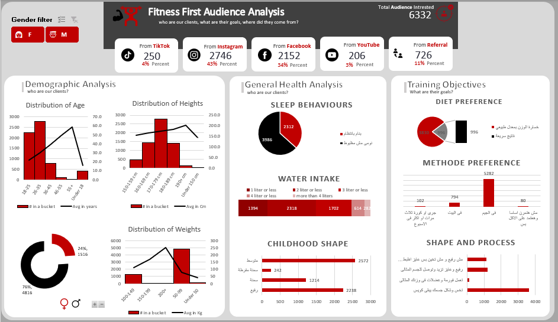

# Fitness First Audience Analysis Dashboard


## Overview

This project presents an audience analysis for a fitness-focused brand, created to provide insights into the demographics, behaviors, and training preferences of the brand's clients.  
The dashboard is designed as part of a data analyst portfolio to highlight skills in data visualization, demographic analysis, and health behavior assessment.

The primary goals of this analysis are to:
- Identify the demographic distribution of the client base.
- Understand client health behaviors and preferences.
- Provide actionable insights for marketing and product development teams.

---
## Key Skills Demonstrated

This project demonstrates the following skills:
- **Data Cleaning** : Using Python, PowerQuery collectively to make clean able-to-analysis data. 
- **Data Visualization**: Creating clear and visually engaging charts and graphs to represent complex data insights.
- **Data Analysis**: Conducting demographic and behavioral analyses to identify patterns and trends in client preferences.
- **Excel Proficiency**: Leveraging pivot tables and advanced Excel functions to summarize and analyze data efficiently.
- **Dashboard Design**: Developing a comprehensive and easy-to-navigate dashboard layout to convey insights effectively to stakeholders.

---

## Data Cleaning and Preprocessing
Before building the dashboard the raw data underwent some cleaning mainly with:  

1- **PowerQuery**  
2- **Python** 


### PowerQuery
- used complex M Language code to generate conditional and custom columns to serve analysis purposes.
  
  

### Python Code for Data Cleaning

used python specifically for a manually typed cities location data that is not typed properly.    
this code uses ***levenshtein distance*** to elect most probable word matches from the typed input on our raw data, against starderd cities named to lookup from and replace. here is a sample 
```python
import pandas as pd
import re

# Load the datasets
df = pd.read_excel('Updated_Analysis_needa.xlsx')
egypt_df = pd.read_csv('egypt_cities.csv')

# Create a dictionary mapping cities to governorates
city_gov_map = {}
for _, row in egypt_df.iterrows():
    cities = row['\u0627\u0644\u0645\u062f\u0646 \u0627\u0644\u0631\u0626\u064a\u0633\u064a\u0629'].split('\u060c')
    gov = row['\u0627\u0644\u0645\u062d\u0627\u0641\u0638\u0629']
    for city in cities:
        city = city.strip()
        city_gov_map[city] = gov

def find_best_match(text, min_length=4):
    if pd.isna(text):
        return None, "could not find a match"
    
    text = str(text)
    best_match = None
    best_score = 0
    
    # Try different positions in the text
    for start_pos in range(len(text) - min_length + 1):
        for length in range(min_length, min(len(text) - start_pos + 1, 15)):
            pattern = text[start_pos:start_pos + length]
            pattern = re.escape(pattern)
            
            matches = [(city, gov) for city, gov in city_gov_map.items() 
                      if re.search(pattern, city, re.IGNORECASE)]
            
            if matches:
                if len(matches) == 1:
                    return matches[0][1], "matched"
                score = length * (1.0 if start_pos == 0 else 0.8)
                if score > best_score:
                    best_score = score
                    best_match = matches[0][1]
    
    if best_match:
        return best_match, "matched"
    return text, "original value kept"  # Return original text instead of None

```
---
## Dashboard Breakdown

The dashboard is structured into several key sections to provide a comprehensive view of the audience:

### 1. **Demographic Analysis**
   - **Age Distribution**: Visualizes the age ranges of clients, with the largest group falling between 18-25 years.
   - **Height and Weight Distribution**: Shows client distribution across various height and weight categories.
   - **Gender Distribution**: Highlights the gender split, with a significantly larger proportion of female clients.

### 2. **General Health Analysis**
   - **Sleep Behaviors**: Indicates whether clients follow a regulated sleep schedule.
   - **Water Intake**: Tracks clients' daily water intake, categorized into three levels (1 liter or less, 2 liters or less, and more than 4 liters).
   - **Childhood Shape**: Provides insights into the self-reported body shape during childhood, giving clues about long-term fitness journeys.

### 3. **Training Objectives**
   - **Diet Preference**: Shows client preferences between diet plans that are structured or free-form.
   - **Method Preference**: Illustrates clients' preferred training methods, with a notable preference for structured fitness plans.
   - **Shape and Process Goals**: Represents various physical and health goals that clients aim to achieve, ranging from muscle gain to weight management.

---

**Note**: This dashboard is for portfolio display purposes only and is based on anonymized sample data. It does not represent actual client information.


